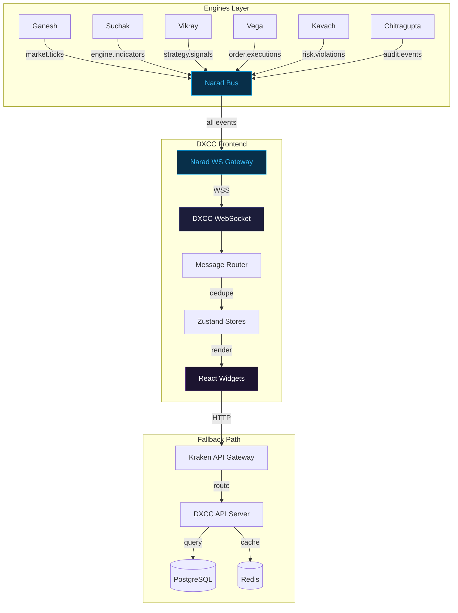

# DXCC — Data Flow

> **Version:** 2.0.0 | **Status:** Draft | **Owner:** DXCC Team | **Last Updated:** 2026-07-24

---

## Primary Data Flow: Real-Time WebSocket

```
+--------+     +-------+     +------------+     +------------+     +---------+     +--------+
| Engine | --> | Narad | --> | Narad WS   | --> | DXCC       | --> | Zustand | --> | UI     |
|        |     | Bus   |     | Gateway    |     | WebSocket  |     | Store   |     | Widget |
+--------+     +-------+     +------------+     +------------+     +---------+     +--------+
     |              |               |                  |                 |                |
     |   Pub event  |   Route to   |  WSS upgrade    |  Parse +       |  Immutable     |  React
     |   to topic   |   subscriber |  with JWT       |  validate      |  state update  |  re-render
     |              |               |                  |                 |                |
     v              v               v                  v                 v                v
  engine.metrics  topic filter   auth success      deduplicate      subscribers      <100ms DOM
  engine.health   consumer grp   topic subs        route to store   notified         update
  strategy.signal                                                    
  risk.violation                                                     
  audit.event                                                        
  market.tick                                                        
```

### Step-by-Step

1. **Engine publishes** a Narad event to its designated topic (e.g., `engine.health.suchak`)
2. **Narad Bus** routes the event based on topic subscriptions and consumer groups, ensuring exactly-once delivery
3. **Narad WS Gateway** receives the event via NATS internal protocol and queues it for WebSocket delivery
4. **DXCC WebSocket** receives the JSON-encoded event over the persistent WSS connection
5. **Message Router** parses the topic, deduplicates via message_id, and routes to the appropriate Zustand store
6. **Zustand Store** performs an immutable state update, notifying all subscribed React components
7. **UI Widget** re-renders with the updated data, completing the flow in under 100ms

---

## Secondary Data Flow: REST API Fallback

```
+--------+     +----------+     +------------+     +----------+     +---------+     +--------+
| Client | --> | Kraken   | --> | DXCC API   | --> | PostgreSQL| --> | React   | --> | UI     |
|        |     | Gateway  |     | Server     |     | / Redis   |     | Query   |     | Widget |
+--------+     +----------+     +------------+     +----------+     +---------+     +--------+
     |              |               |                  |                 |                |
     |  HTTP GET    |  Route +     |  Validate JWT   |  Query /        |  Cache +       |  Loading
     |  /api/...    |  rate limit  |  + authorize     |  fetch          |  stale-while-  |  -> Data
     |              |               |                  |                 |  revalidate    |
     v              v               v                  v                 v                v
  fetch call     API key check   RBAC check        parameterized    optimistic       smooth UX
                 WAF filter      OPA policy        query via pgx    update           transitions
```

### When REST Is Used

- **Historical data:** OHLC data beyond the WebSocket buffer window
- **Configuration CRUD:** Reading and writing engine configurations
- **Audit search:** Complex queries against Chitragupta audit store
- **User management:** CRUD operations on users, roles, permissions
- **Report generation:** Scheduled and on-demand analytics reports
- **WebSocket disconnected:** Fallback polling mode at 5-second intervals

---

## Plugin Subscription Model

```
+---------------------+
| Plugin Manifest.yml |
| (declares topics)   |
+---------+-----------+
          |
          v
+---------------------+
| Manifest Parser     |
| (reads spec.narad)  |
+---------+-----------+
          |
    +-----+-----+
    |           |
    v           v
+-------+   +-------+
|subscribes| |publishes|
|         | |         |
| market. | | engine. |
| ticks   | | indicators|
+----+----+ +----+----+
     |           |
     |      +----v----+
     |      | Topic   |
     |      | Visual- |
     |      | ization |
     |      +---------+
     |
     v
+---------------------+
| Widget declares:    |
| useNaradSubscription|
| ("market.ticks")    |
+---------+-----------+
          |
          v
+---------------------+
| NaradProvider       |
| subscribes topic    |
+---------+-----------+
          |
          v
   [WebSocket to Narad]
```

When a plugin widget mounts:

1. Widget calls `useNaradSubscription("market.ticks")`
2. The hook registers the topic with the NaradProvider context
3. NaradProvider adds the topic to its WebSocket subscription frame
4. Narad WS Gateway starts forwarding messages for that topic
5. On unmount, the hook unregisters, and if no other widget needs the topic, the subscription is removed

---

## Data Deduplication Strategy

```typescript
class MessageDeduplicator {
  private seen: LRUCache<string, number>; // message_id -> timestamp
  private windowMs: number = 60000; // 60 second window

  isDuplicate(messageId: string): boolean {
    if (this.seen.has(messageId)) return true;
    this.seen.set(messageId, Date.now());
    return false;
  }

  // Periodic cleanup of expired entries
  cleanup(): void {
    const cutoff = Date.now() - this.windowMs;
    for (const [id, ts] of this.seen.entries()) {
      if (ts < cutoff) this.seen.delete(id);
    }
  }
}
```

Narad guarantees exactly-once delivery, but WebSocket reconnection may cause duplicate delivery of the last few messages. The deduplicator uses an LRU cache of message IDs with a 60-second window to filter duplicates.

---

## Mermaid Diagram: Complete Flow



---

## Event Types and Routing

| Narad Topic | Source Engine | Target Store | Widget(s) Updated |
|-------------|---------------|--------------|-------------------|
| `market.ticks` | Feed Engine | MarketStore | MarketWatch, TickTape, OHLCChart |
| `market.ohlc.*` | Ganesh | MarketStore | OHLCChart, TopMovers |
| `engine.indicators` | Suchak | IndicatorStore | MOIndicatorOverlay |
| `engine.health.*` | All engines | EngineStore | EngineHealthMatrix, HealthTimeline |
| `strategy.signals` | Vikray | StrategyStore | SignalLog, StrategyPerformance |
| `order.*` | Vega | OrderStore | OrderBlotter, ExecutionLog, LatencyMonitor |
| `risk.violations` | Kavach | RiskStore | ViolationFeed, RiskHeatmap |
| `risk.suraksha` | Kavach | RiskStore | SurakshaScoreDashboard |
| `audit.events` | Chitragupta | AuditStore | AuditSearch, AuditTimeline |
| `alert.firing` | AlertManager | AlertStore | AlertInbox, RecentAlerts |
| `incident.*` | Internal | IncidentStore | ActiveIncidents, IncidentDetail |
| `infra.metrics` | Prometheus | InfraStore | InfraMonitor, K8sClusterView |

---

> **Next:** See [08-topology.md](08-topology.md) for the ecosystem topology and DXCC's position within it.
