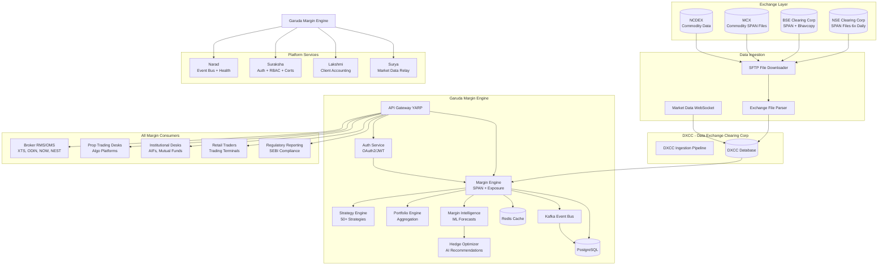

# 08 — Topology

## Ecosystem Position

Garuda Margin Engine sits at the center of the Indian derivatives trading technology stack, ingesting exchange data from upstream providers and serving margin calculations to all downstream consumers.



## Topology Layers

### Layer 1: Exchange Data Sources
Exchanges publish SPAN parameter files, contract master files, bhav copies (settlement prices), and corporate action circulars. These are the authoritative sources for all margin computation parameters. SPAN files updated 6 times daily (NSE schedules: 8:15 AM, 10:00 AM, 12:00 PM, 2:00 PM, 4:00 PM, 6:00 PM IST).

### Layer 2: DXCC (Data Exchange Clearing Corp)
The DXCC layer acts as the ingestion and normalization pipeline for all exchange data. It standardizes file formats across exchanges, validates data integrity, and maintains a unified database. Garuda consumes from DXCC rather than directly from exchange servers.

### Layer 3: Garuda Margin Engine
The core computational layer. Receives position data from brokers, loads exchange parameters from DXCC, computes all margin types, applies intelligence and optimization, and serves results via APIs.

### Layer 4: Platform Services
- **Narad**: Registers Garuda services for health monitoring, handles margin change event broadcasting across the ecosystem
- **Suraksha**: Centralized authentication validation, RBAC enforcement, certificate lifecycle management
- **Lakshmi**: Client fund/ledger accounting; provides available margin data for utilization tracking
- **Surya**: Real-time market data relay from exchange WebSocket feeds to all platform consumers

### Layer 5: Margin Consumers
All downstream systems that consume margin data:
- **Broker RMS/OMS**: Pre-trade margin validation, post-trade risk monitoring
- **Prop Desks**: Strategy margin estimation, real-time P&L + margin overlays
- **Institutional Desks**: Portfolio-level optimization, multi-broker aggregation
- **Retail Terminals**: Simple margin display before order placement
- **Regulatory Reporting**: SEBI peak margin, EOD margin, client-wise utilization reports

## Deployment Topology (Production)

```
Region: India Central (Azure) / ap-south-1 (AWS)

AZ 1:
├── AKS/EKS Node Pool 1: 4 worker nodes
├── PostgreSQL Primary (Multi-AZ)
├── Redis Master 1
├── Kafka Broker 1, 2

AZ 2:
├── AKS/EKS Node Pool 2: 4 worker nodes
├── PostgreSQL Sync Replica
├── Redis Master 2 + Slave
├── Kafka Broker 3, 4

AZ 3:
├── AKS/EKS Node Pool 3: 4 worker nodes
├── PostgreSQL Async Replica (DR)
├── Redis Master 3 + Slave
├── Kafka Broker 5 (controller)

DR Region (India South / ap-south-2):
├── Standby K8s Cluster (scaled to 0)
├── PostgreSQL Standby (Async)
├── Kafka MirrorMaker Replication
└── Blob Storage RA-GRS
```

## Network Topology

```
Internet → Azure Front Door / Cloudflare (WAF + DDoS)
    → NGINX Ingress Controller (TLS termination)
    → API Gateway Service (YARP)
    → Internal Services (mTLS via Linkerd)
    → PostgreSQL / Redis / Kafka (private endpoints)
```
