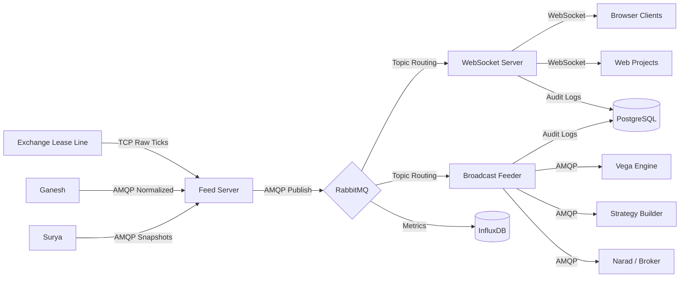

# 04 — High-Level Architecture

## Architecture Overview

Lakshmi employs a **four-component pipeline** architecture that separates ingestion, brokering, streaming, and directed delivery into distinct, independently scalable layers.

```
┌─────────────────┐     ┌──────────────────┐     ┌─────────────────────┐     ┌───────────────────┐
│   Feed Server   │────▶│   RabbitMQ        │────▶│   Local WebSocket   │────▶│   Broadcast        │
│  (Exchange Line)│     │   (Primary+Alt)   │     │   Server            │     │   Feeder           │
└─────────────────┘     └──────────────────┘     └─────────────────────┘     └───────────────────┘
        │                        │                         │                         │
        ▼                        ▼                         ▼                         ▼
  Exchange Ticks          MQ Topics/Queues         Browser Clients           Directed Engines
```

## Component Descriptions

### 1. Feed Server
- **Purpose:** Connects directly to exchange lease lines and upstream providers (Ganesh, Surya).
- **Function:** Receives raw market data, performs basic validation, normalizes to internal message format, and publishes to RabbitMQ.
- **Technology:** Custom TCP client, AMQP 0-9-1 publisher.

### 2. RabbitMQ Cluster (Primary + Alternate)
- **Purpose:** Durable, high-availability message broker.
- **Function:** Manages exchanges, queues, bindings, and topic routing. Provides message persistence, dead-letter handling, and consumer acknowledgment.
- **Topology:** 3-node cluster with mirrored queues. Primary and alternate exchanges for failover.

### 3. Local WebSocket Server
- **Purpose:** Streams live market data to browser-based clients and thin terminals.
- **Function:** Consumes from RabbitMQ, fans out to connected WebSocket clients, applies per-connection topic filters, and sends heartbeats.
- **Technology:** Node.js `ws` library, Redis for connection state.

### 4. Broadcast Feeder
- **Purpose:** Directed delivery to specific downstream engines.
- **Function:** Routes messages based on subscription rules, manages engine-specific queues, handles backpressure, and retries failed deliveries.
- **Technology:** AMQP consumer with custom routing logic.

## Communication Flow



## External Integrations

| System | Direction | Protocol | Data |
|---|---|---|---|
| **Ganesh** | Inbound | AMQP 0-9-1 | Normalized market ticks |
| **Surya** | Inbound | AMQP 0-9-1 | Market depth, OHLC snapshots |
| **Narad** | Outbound | AMQP 0-9-1 | Order confirmations, trade reports |
| **Suraksha** | Outbound | REST/HTTPS | API key validation, access tokens |
| **Prometheus** | Outbound | HTTP | `/metrics` endpoint scrape |
| **Grafana** | — | Reads from InfluxDB/Prometheus | Dashboards |

## High Availability Design

- **RabbitMQ:** 3-node cluster with quorum queues. Automatic failover via HAProxy/TCP load balancer in front.
- **WebSocket Server:** Stateless design with Redis-backed session store. Multiple instances behind a load balancer.
- **Feed Server:** Active-passive pair with heartbeat monitoring. Failover triggered via keepalived.

## Capacity Planning

| Metric | Current | Projected (12 months) |
|---|---|---|
| Messages/second | 350,000 | 500,000 |
| Concurrent WebSocket connections | 2,000 | 5,000 |
| Active MQ queues | 150 | 300 |
| Daily data volume | 2 TB | 3.5 TB |
