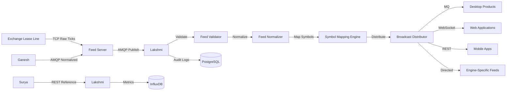

# 04 — High-Level Architecture

## Architecture Overview

Lakshmi employs a **16-component pipeline** architecture that separates ingestion, validation, normalization, symbol mapping, caching, and distribution into distinct, independently scalable layers.

```
                         Surya
                           │
                   BOD Reference Data
                           │
                           ▼

                +----------------------+
                |    Lakshmi Engine    |
                +----------------------+

        Primary Feed Manager
               │
          Feed Validator
               │
        Feed Normalizer
               │
      Symbol Mapping Engine
               │
      Broadcast Distributor
               │
        Alternate Feed Manager
               │
        Health Monitor
               │
      Replay Synchronizer
               │
        Feed Recorder
               │
        Latency Monitor
               │
        Statistics Engine
               │
        Permission Layer
               │
        Message Queue
               │
        WebSocket Server
               │
        REST Cache
               │
      Subscription Manager
```

## Component Descriptions

### 1. Feed Server (Sub-component)
- **Purpose:** Connects directly to exchange lease lines.
- **Function:** Receives raw market data, performs basic validation, normalizes to internal message format.
- **Technology:** Custom TCP client, AMQP 0-9-1 publisher.
- **Note:** Sub-component of Lakshmi — no other engine connects to exchange directly.

### 2. Primary Feed Manager
- **Purpose:** Manages acquisition of feeds from Feed Server and alternate sources.
- **Function:** Coordinates primary feed acquisition, monitors health, triggers failover.

### 3. Feed Validator
- **Purpose:** Validates each packet for integrity.
- **Checks:** CRC, packet length, sequence, timestamp, duplicates, missing packets, corrupted packets.

### 4. Feed Normalizer
- **Purpose:** Protocol translation and format standardization.
- **Function:** Converts exchange-specific formats into unified internal message format.

### 5. Symbol Mapping Engine
- **Purpose:** Exchange token to internal instrument ID mapping.
- **Rule:** No engine stores exchange tokens. Only Lakshmi knows exchange mappings.
- **Example:** NSE Token → Internal Instrument ID → Used Everywhere.

### 6. Broadcast Distributor
- **Purpose:** Multi-channel distribution to all downstream engines.
- **Channels:** MQ (primary + alternate), WebSocket, REST, Shared Memory.

### 7. Alternate Feed Manager
- **Purpose:** Automatic failover to backup data sources.
- **Sources:** Feed Server Backup, Secondary Lease Line, Broker Broadcast, Vendor Feed, Cloud Feed, Historical Replay, Manual Injection.
- **Behavior:** Lakshmi automatically switches source. No engine knows which source is active.

### 8. Health Monitor
- **Purpose:** Real-time feed health monitoring.
- **Metrics:** Active source, feed delay, packets/sec, messages/sec, latency, CPU, memory, queue size.

### 9. Replay Synchronizer
- **Purpose:** Missing packet recovery.
- **Function:** Detects sequence breaks and triggers replay from backup sources.

### 10. Feed Recorder
- **Purpose:** Archive and audit trail.
- **Function:** Records all packets for compliance and debugging.

### 11. Latency Monitor
- **Purpose:** Performance tracking per packet.
- **Function:** Measures end-to-end latency from exchange to each subscriber.

### 12. Statistics Engine
- **Purpose:** Metrics aggregation.
- **Metrics:** Packets/sec, messages/sec, dropped packets, missing packets, duplicate packets.

### 13. Permission Layer
- **Purpose:** Subscription authorization.
- **Function:** Controls which engines/clients can subscribe to which data streams.

### 14. Message Queue
- **Purpose:** Primary + alternate MQ distribution.
- **Used by:** Desktop products (TalkDelta, TalkOptions, Margin Calculator, Excel Addin, Desktop APIs).

### 15. WebSocket Server
- **Purpose:** Web application streaming.
- **Used by:** React, Flutter, Angular, NextJS, Trading Dashboard, Admin Portal.

### 16. REST Cache
- **Purpose:** Snapshot API for login, dashboard, initial load, mobile.
- **Use case:** Instead of streaming, provide point-in-time snapshots.

### 17. Subscription Manager
- **Purpose:** Dynamic subscriptions to reduce unnecessary traffic.
- **Supports:** Underlying, token, segment, expiry, strike, strategy, engine, client, application.

## Feed Types

| Feed Type | Fields |
|---|---|
| **Market Feed** | LTP, LTQ, LTT, Open, High, Low, Close, ATP, Volume, OI |
| **Depth Feed** | Best Bid, Best Ask, 5 Level, 20 Level |
| **Option Feed** | IV, Greeks, Bid IV, Ask IV, Synthetic, Spot IV, Forward IV |
| **Index Feed** | Nifty, BankNifty, FinNifty, Sensex, Bankex, MCX Indices |
| **Settlement Feed** | From Feed Server |

## Data Flow

```
Exchange
     │
Lease Line
     │
Feed Server
     │
Lakshmi Receiver
     │
Validation
     │
Normalization
     │
Compression
     │
Caching
     │
Distribution
```

## Distribution Channels

| Channel | Protocol | Used By |
|---|---|---|
| **MQ** | AMQP | Desktop EXE Products (TalkDelta, TalkOptions, Margin Calculator, Excel Addin) |
| **WebSocket** | WS/WSS | Web Applications (React, Flutter, Angular, NextJS) |
| **REST** | HTTP/HTTPS | Login, Dashboard, Initial Load, Mobile |
| **Shared Memory** | IPC | In-process consumers |
| **Kafka** (Future) | Kafka Protocol | High-throughput streaming |
| **gRPC** (Future) | gRPC | Ultra-low latency distribution |
| **Redis Streams** (Future) | Redis | Horizontal scaling |

## Communication Flow



## High Availability Design

- **Feed Server:** Active-passive pair with heartbeat monitoring. Failover triggered via keepalived.
- **RabbitMQ:** 3-node cluster with quorum queues. Automatic failover via HAProxy/TCP load balancer.
- **WebSocket Server:** Stateless design with Redis-backed session store. Multiple instances behind a load balancer.
- **Alternate Feed Manager:** Automatic failover between primary and alternate data sources.

## Feed Priority

| Priority | Source |
|---|---|
| 1 | Exchange Lease Line |
| 2 | Feed Server Backup |
| 3 | Secondary Lease Line |
| 4 | Vendor Feed |
| 5 | Broker Feed |
| 6 | Replay Feed |

## Capacity Planning

| Metric | Current | Projected (12 months) |
|---|---|---|
| Messages/second | 350,000 | 500,000 |
| Concurrent WebSocket connections | 2,000 | 5,000 |
| Active MQ queues | 150 | 300 |
| Daily data volume | 2 TB | 3.5 TB |

## Fault Tolerance

### Detect
- No broadcast
- Sequence break
- Corrupt packet
- Feed freeze
- High latency
- Queue overflow
- Slow subscriber
- Memory leak
- CPU spike

### Automatically
- Restart receiver
- Switch feed
- Recover queue
- Notify Narad
- Log RCA
- Alert Suraksha

## Monitoring Dashboard

Real-time display of:
- Active Source
- Feed Delay
- Packets/sec
- Messages/sec
- Latency
- CPU
- Memory
- Queue Size
- Dropped Packets
- Missing Packets
- Duplicate Packets
- Subscribers
- WebSocket Connections
- MQ Clients
- API Requests
- Failover Status
