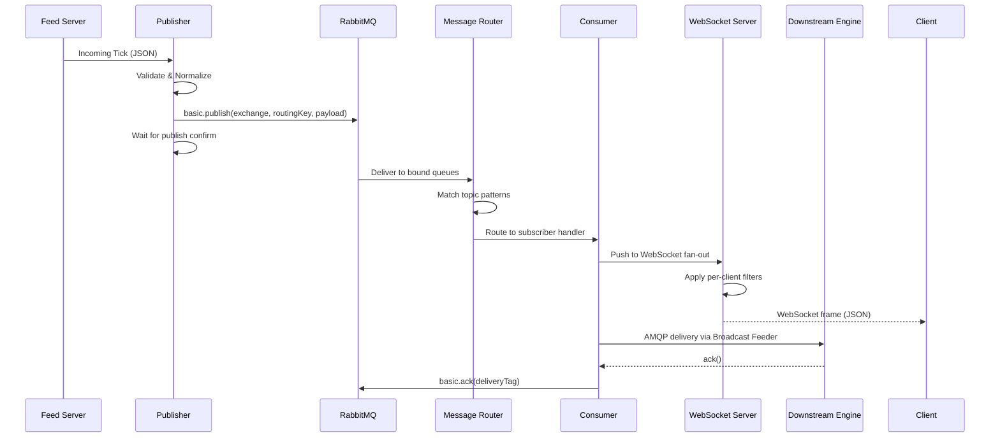

# 05 — Low-Level Design

## Internal Module Architecture

Lakshmi is composed of 10 internal modules, each responsible for a distinct aspect of the data distribution pipeline.

```
┌──────────────────────────────────────────────────────────────────┐
│                        LAKSHMI ENGINE                            │
├──────────────┬──────────────┬──────────────┬─────────────────────┤
│  Publisher   │  Consumer    │ Topic Mgr    │  Queue Manager      │
├──────────────┼──────────────┼──────────────┼─────────────────────┤
│ Message      │  Cache       │  Monitoring  │  Analytics          │
│ Router       │              │              │                     │
├──────────────┼──────────────┼──────────────┼─────────────────────┤
│ Retry Engine │  Security    │              │                     │
└──────────────┴──────────────┴──────────────┴─────────────────────┘
```

## Module Details

### Publisher (`src/publisher.js`)
```javascript
class Publisher {
  connect(url, options)          // Establish AMQP connection
  publish(topic, payload, opts)  // Publish message with routing key
  confirmHandler()               // Handle publisher acknowledgments
  disconnect()                   // Graceful AMQP shutdown
}
```
- **Purpose:** Accepts incoming messages from feed sources and publishes to RabbitMQ topics.
- **Key Configs:** `confirmChannel`, `mandatory`, `persistent`.
- **Error Handling:** On publish failure, logs to error queue and triggers retry via Retry Engine.

### Consumer (`src/consumer.js`)
```javascript
class Consumer {
  subscribe(topicPattern, handler)  // Bind to topic, register callback
  consume(queueName, prefetch)     // Start consuming from queue
  ack(message)                     // Acknowledge message processing
  nack(message, requeue)           // Negative-acknowledge with requeue
}
```
- **Purpose:** Subscribes to RabbitMQ topics and delivers messages to internal handlers.
- **QoS:** Configurable prefetch count (default: 50) to prevent overwhelming slow consumers.

### Topic Manager (`src/topic-manager.js`)
```javascript
class TopicManager {
  createTopic(name, options)       // Register a new topic in the catalog
  deleteTopic(name)                // Remove topic and unbind subscribers
  listTopics()                     // Return all active topics with metadata
  matchTopic(pattern, routingKey)  // Test if routing key matches topic pattern
}
```
- **Purpose:** Maintains the topic catalog, validates patterns, and manages topic lifecycle.
- **Pattern Support:** `*` (single word), `#` (zero or more words).

### Queue Manager (`src/queue-manager.js`)
```javascript
class QueueManager {
  declareExchange(name, type)     // idempotently declare exchange
  bindQueue(queue, exchange, key) // bind queue to exchange with routing key
  createDeadLetter(exchange)     // set up dead-letter exchange and queue
  purgeQueue(name)                // drain all messages from a queue
}
```
- **Purpose:** Manages RabbitMQ topology—exchanges, queues, bindings, and dead-letter handling.
- **Exchange Types:** `topic` for pub/sub, `direct` for point-to-point, `fanout` for broadcast.

### Message Router (`src/message-router.js`)
```javascript
class MessageRouter {
  route(message)                  // Determine destination based on topic + rules
  registerRoute(pattern, target)  // Add routing rule
  loadRoutingTable()              // Reload routing table from PostgreSQL
}
```
- **Purpose:** Matches incoming messages against subscriber rules and routes to correct outbound queues.
- **Implementation:** In-memory topic trie for O(k) matching where k = topic depth.

### Cache (`src/cache.js`)
```javascript
class Cache {
  get(key)                // Retrieve value by key
  set(key, value, ttl)    // Store value with expiry (TTL)
  del(key)                // Invalidate cache entry
  exists(key)             // Check key existence
  getSetMembers(key)      // Get all members of a Redis set
}
```
- **Purpose:** Redis-backed cache for hot data, deduplication windows, and subscriber state.
- **TTL Defaults:** Tick cache: 5s; Subscriber list: 30s; Rate limiter: 1s window.

### Monitoring (`src/monitoring.js`)
```javascript
class Monitoring {
  startHealthServer(port)           // Expose /health and /metrics endpoints
  recordMetric(name, value, tags)   // Emit metric to Prometheus registry
  trackLatency(operation, fn)       // Instrument function with latency tracking
  alert(severity, message)          // Trigger alert via webhook
}
```
- **Purpose:** Enables observability via Prometheus metrics, health probes, and alerting webhooks.

### Analytics (`src/analytics.js`)
```javascript
class Analytics {
  recordThroughput(topic, count)     // Per-topic message count
  recordLatency(component, ms)      // Component-level latency bucket
  recordError(type, message)        // Error classification and counting
  getStats(windowMs)                // Aggregate stats for time window
  exportToInfluxDB(batch)           // Write batch of time-series points
}
```
- **Purpose:** Computes sliding-window statistics and writes to InfluxDB for dashboarding.

### Retry Engine (`src/retry-engine.js`)
```javascript
class RetryEngine {
  enqueue(message, attempts, nextDelay) // Add failed message to retry queue
  processRetries()                       // Process pending retries
  getQueueSize()                         // Current retry queue depth
  configure(strategy, maxAttempts, baseDelayMs)
}
```
- **Purpose:** Handles transient delivery failures with configurable retry strategies.
- **Strategies:** `fixed`, `exponential`, `linear`. Default: exponential with max 5 attempts, base 100ms.

### Security (`src/security.js`)
```javascript
class Security {
  validateApiKey(key, scope)      // Validate key via Suraksha or local cache
  authorizeTopic(identity, topic)  // Check if identity can publish/subscribe
  encryptPayload(data)            // Encrypt sensitive payload fields
  rotateKeys()                    // Trigger key rotation sequence
}
```
- **Purpose:** Enforces authentication and authorization at the ingress/egress boundaries.

## Message Processing Sequence



## Concurrency Model

- Each RabbitMQ connection has a dedicated Node.js worker (child process via PM2 cluster mode).
- Prefetch count limits in-flight messages per consumer to prevent memory exhaustion.
- Redis operations are pipelined for batch efficiency.
- Message validation uses worker threads (node:worker_threads) to avoid blocking the event loop in production.
