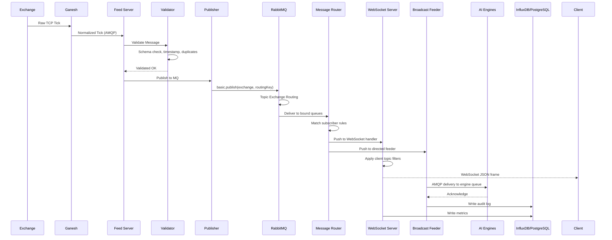

# 07 — Data Flow

## Complete Data Flow Pipeline

This document traces a market tick from its origin at the exchange through every processing stage within Lakshmi until it reaches the final consumer application.

## High-Level Flow



## Stage-by-Stage Breakdown

### Stage 1: Exchange Tick Reception

```
Exchange (NSE/BSE) ──[TCP/Proprietary]──▶ Ganesh ──[AMQP]──▶ Lakshmi Feed Server
```

- Raw ticks arrive from the exchange lease line at Ganesh.
- Ganesh normalizes tick structure and enriches with symbol metadata.
- Ganesh publishes normalized tick to `market.live.raw` exchange on RabbitMQ.
- Lakshmi Feed Server consumes from this exchange.

### Stage 2: Message Validation

```json
{
  "symbol": "NIFTY24JULFUT",
  "exchange": "NSE",
  "ltp": 24532.15,
  "volume": 1250000,
  "timestamp": "2026-07-24T10:30:00.123Z",
  "source": "ganesh",
  "sequence": 8472910
}
```

Validation checks performed:
1. **Schema Validation:** All required fields present with correct types.
2. **Timestamp Check:** Message age < 5 seconds (stale data rejection).
3. **Duplicate Detection:** Redis SET with 30-second sliding window on `exchange:symbol:sequence`.
4. **Range Check:** LTP within ±20% of previous close (flash crash guard).

### Stage 3: Publish to RabbitMQ

| Attribute | Value |
|---|---|
| Exchange | `lakshmi.market` |
| Exchange Type | `topic` |
| Routing Key | `market.live.NSE.FUT.NIFTY` |
| Delivery Mode | Persistent (2) |
| Content Type | `application/json` |
| Message ID | UUID v4 |

### Stage 4: Topic Routing

The routing key `market.live.NSE.FUT.NIFTY` is matched against subscriber patterns:

| Subscriber | Pattern | Match? |
|---|---|---|
| Vega Engine | `market.live.NSE.*.*` | Yes |
| Brahma Engine | `market.live.*.FUT.*` | Yes |
| Dashboard | `market.live.#` | Yes |
| Broker-A | `market.live.BSE.#` | No |

### Stage 5: Subscriber Delivery

**WebSocket Path (Browser Clients):**
1. WebSocket Server holds subscriber pattern → socket ID mappings in Redis.
2. Message is serialized to compact JSON.
3. Fan-out sends to all matched sockets, applying per-client field whitelist.
4. Client receives frame and updates UI/recalculates indicators.

**AMQP Path (AI Engines):**
1. Broadcast Feeder identifies target engine queues from routing table.
2. Message is re-published to engine-specific AMQP queue (e.g., `engine.vega.input`).
3. Engine consumes, processes, and sends acknowledgment.
4. Broadcast Feeder writes delivery confirmation to audit log.

### Stage 6: Execution Flow

```
AI Engine receives tick → Evaluates strategy conditions → Generates signal
    → (if signal triggers) → Creates order → Routes to Broker via Narad
    → Broker executes → Confirmation flows back through Lakshmi → Broadcast Feeder
    → Trade confirmation delivered to reporting engines
```

### Stage 7: Reporting & Logging

| Data | Destination | Retention |
|---|---|---|
| All published messages | InfluxDB (throughput counter) | 90 days |
| Delivery confirmations | PostgreSQL `messages` table | 30 days |
| Errors and retries | PostgreSQL `audit_log` table | 1 year |
| Performance metrics | Prometheus / InfluxDB | 90 days |

## Error Flow

```
Message → Consume → Error → Classify Error Type
    ├── Transient (network timeout, broker busy) → Retry Engine → Retry queue → Backoff → Re-publish
    ├── Permanent (invalid schema, auth denied) → Dead-Letter Queue → Alert → Manual review
    └── Duplicate (already processed) → Drop → Increment dedup counter
```

## Throughput Characteristics

| Stage | Latency (p50) | Latency (p99) | Bottleneck |
|---|---|---|---|
| Feed Server → Publisher | 0.3ms | 1.2ms | Network jitter |
| Publisher → RabbitMQ | 0.1ms | 0.5ms | — (localhost) |
| RabbitMQ Routing | 0.05ms | 0.2ms | — |
| Consumer → WebSocket | 0.2ms | 0.8ms | Serialization |
| Consumer → Broadcast Feeder | 0.1ms | 0.4ms | — |
| **Total Internal** | **0.75ms** | **3.1ms** | |
