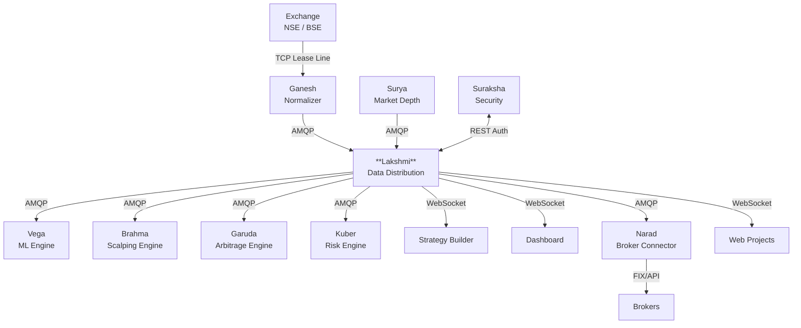

# 08 — Ecosystem Topology

## Ecosystem Position

Lakshmi sits at the **center** of the Algo-IQ ecosystem, bridging upstream market data providers with downstream consumers. All real-time market data flows through Lakshmi before reaching any consuming application.



## Connected Components

### Upstream (Data Sources)

| Component | Role | Protocol | Port | Description |
|---|---|---|---|---|
| **Exchange** | Raw market data | TCP proprietary | varies | NSE and BSE lease-line feeds |
| **Ganesh** | Tick normalization | AMQP 0-9-1 | 5672 | Pre-processes and enriches raw ticks before Lakshmi ingestion |
| **Surya** | Market depth & OHLC | AMQP 0-9-1 | 5672 | Provides order book depth and OHLC snapshots |

### Core Infrastructure

| Component | Role | Protocol | Port | Description |
|---|---|---|---|---|
| **RabbitMQ** | Message broker | AMQP | 5672, 15672 | 3-node cluster handling all pub/sub messaging |
| **Redis** | In-memory cache | TCP | 6379 | Hot data, deduplication, session state |
| **PostgreSQL** | Persistent storage | TCP | 5432 | Topics catalog, subscribers, audit logs |
| **InfluxDB** | Time-series metrics | HTTP | 8083 | Throughput and latency time-series |

### Downstream (Consumers)

| Component | Role | Delivery | Pattern | Description |
|---|---|---|---|---|
| **Vega** | ML strategy engine | RabbitMQ | `market.live.*` | AI-driven signal generation |
| **Brahma** | Scalping engine | RabbitMQ | `market.live.*` | Ultra-low-latency scalping |
| **Garuda** | Arbitrage engine | RabbitMQ | `market.live.*` | Cross-exchange arbitrage |
| **Kuber** | Risk management | RabbitMQ | `market.ohlc.*` | Portfolio risk and exposure |
| **Strategy Builder** | Visual strategy IDE | WebSocket | `market.*` | Frontend for strategy creation |
| **Algo-IQ Dashboard** | Monitoring dashboard | WebSocket | `stream.*` | Real-time market data display |
| **Narad** | Broker connector | RabbitMQ | `trade.confirm.*` | Order routing to external brokers |
| **Web Projects** | External web apps | WebSocket | `market.*` | Public-facing trading interfaces |

### Security

| Component | Role | Protocol | Port | Description |
|---|---|---|---|---|
| **Suraksha** | Auth & access control | REST/HTTPS | 443 | Validates API keys and manages access scopes |

## Protocol Summary

| Protocol | Used Between | Characteristics |
|---|---|---|
| **TCP (Proprietary)** | Exchange → Ganesh | Ultra-low-latency, binary format |
| **AMQP 0-9-1** | Ganesh/Surya → Lakshmi → Engines | Reliable, brokered, persistent |
| **WebSocket** | Lakshmi → Browser Clients | Full-duplex, low-overhead framing |
| **REST/HTTPS** | Lakshmi ↔ Suraksha | Request/response, TLS 1.3 |
| **HTTP** | Prometheus → Lakshmi | Metrics scrape |

## Data Domain Boundaries

```
┌────────── Raw Market Data ──────────┐
│  Exchange → Ganesh → Lakshmi        │
│  (Source of truth: Exchange)        │
├────────── Normalized Ticks ─────────┤
│  Lakshmi → All Consumers            │
│  (Source of truth: Lakshmi cache)   │
├────────── Derived Signals ──────────┤
│  AI Engines → Strategy execution    │
│  (Source of truth: Engine output)   │
├────────── Trade Confirmations ──────┤
│  Broker → Narad → Lakshmi → DB      │
│  (Source of truth: Broker)          │
└─────────────────────────────────────┘
```

## Failure Domain Isolation

- If Ganesh fails: Lakshmi continues serving cached data from Redis for 5 seconds, then goes stale.
- If RabbitMQ fails: Messages accumulate in Feed Server buffer (up to 10 seconds), then are dropped.
- If a downstream engine disconnects: Its dedicated queue persists messages. No impact on other subscribers.
- If Lakshmi fails: All consumers detect heartbeat loss within 15 seconds and enter degraded mode.
