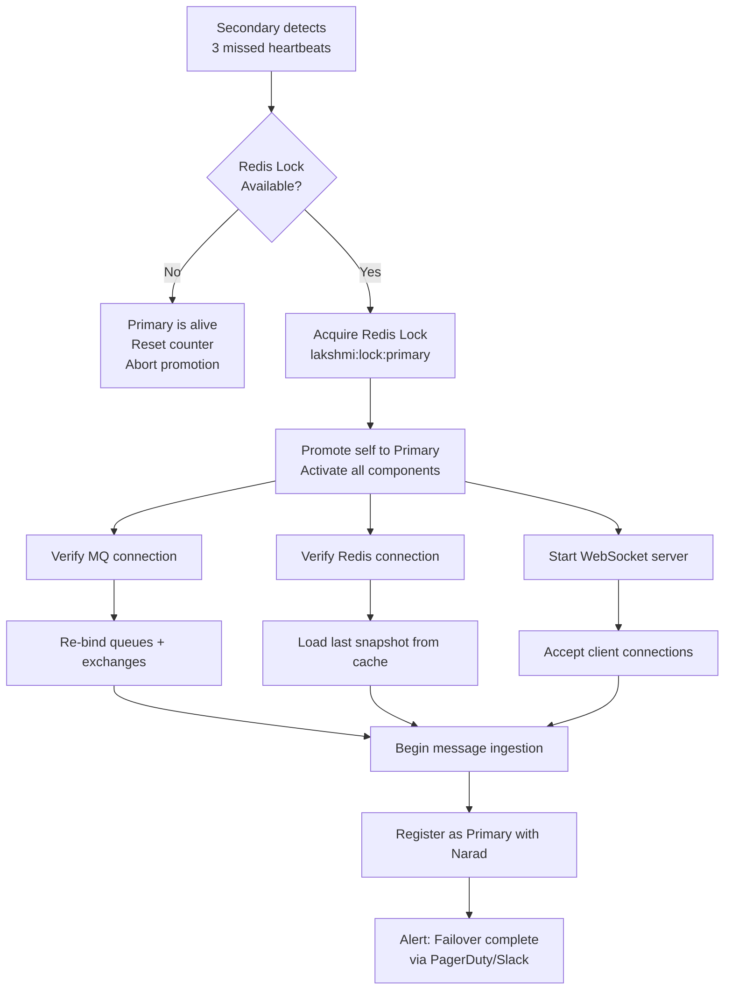
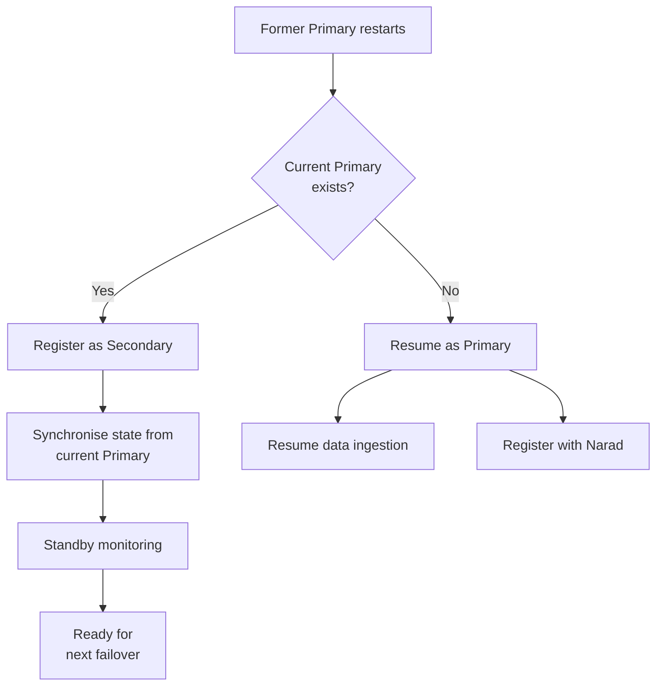
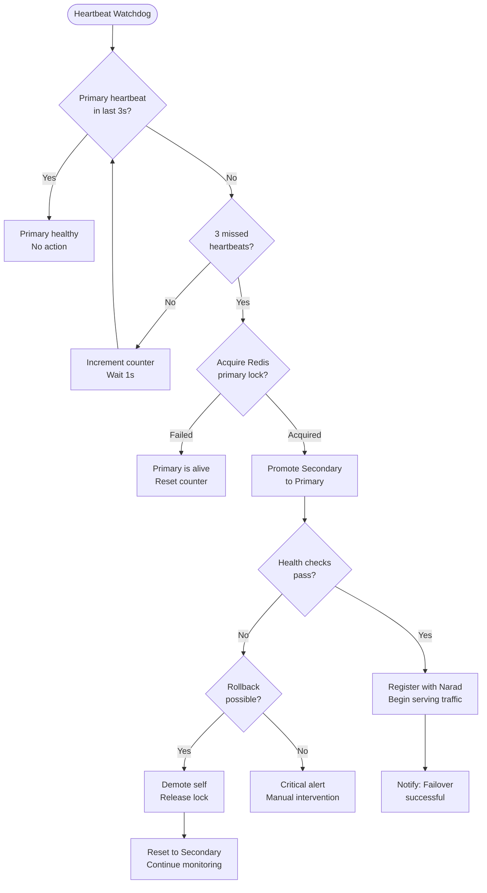

# 18. Failover & High Availability

**Version:** 2.1.0
**Owner:** Platform Engineering / SRE
**Last Updated:** 2026-07-24

---

## Overview

Lakshmi operates in a Primary/Secondary (Active/Passive) architecture to ensure continuous market data delivery. The failover mechanism is automated, driven by heartbeat monitoring and coordinated through Narad service discovery. Failover completes in under 5 seconds from detection to traffic switching.

---

## Primary/Secondary Architecture

```
┌─────────────────────────────────────────────────────────┐
│                    Load Balancer / Narad                 │
│              Routes traffic to Primary only              │
└──────────────┬──────────────────────┬───────────────────┘
               │                      │
         ┌─────▼─────┐          ┌─────▼─────┐
         │  PRIMARY   │  ◄────►  │ SECONDARY  │
         │  Lakshmi   │  Sync    │  Lakshmi   │
         │  Node-1    │          │  Node-2    │
         └─────┬───────┘          └──────┬─────┘
               │                         │
      ┌────────┼────────┐       ┌───────┼─────────┐
      │        │        │       │       │         │
   ┌──▼──┐ ┌──▼──┐ ┌───▼──┐ ┌──▼──┐ ┌──▼──┐ ┌───▼──┐
   │ MQ  │ │Redis│ │Config│ │ MQ  │ │Redis│ │Config│
   │Primary│Primary│ │Sync │ │Standby│Standby│ │Sync │
   └─────┘ └─────┘ └──────┘ └─────┘ └─────┘ └──────┘
```

### Node Roles

| Role | Responsibilities | Active Components |
|---|---|---|
| **Primary** | Message ingestion, publishing, routing, WebSocket serving | All components active |
| **Secondary** | Standby; receives replicated state; monitors Primary | MQ/Redis connected (passive); health watcher active |
| **Witness (optional)** | Tie-breaker in split-brain scenarios | Narad-based quorum observer |

---

## Heartbeat Detection

### Primary Heartbeat Emission

The Primary emits a heartbeat every **1 second** to the Narad mesh and to a dedicated Redis key:

```
SET lakshmi:heartbeat:primary "alive" EX 3
```

### Secondary Heartbeat Monitoring

The Secondary monitors the Primary heartbeat via two independent channels:

| Channel | Mechanism | Timeout |
|---|---|---|
| **Narad Mesh** | Narad health check aggregation | 3 seconds |
| **Redis Key** | `GET lakshmi:heartbeat:primary` + TTL watch | 3 seconds (TTL-based) |

### Failover Trigger: 3 Missed Heartbeats

```
Heartbeat Timeline:
  t=0s:  Primary heartbeat OK
  t=1s:  Primary heartbeat OK
  t=2s:  Primary heartbeat MISSED (count=1)
  t=3s:  Primary heartbeat MISSED (count=2)
  t=4s:  Primary heartbeat MISSED (count=3) → FAILOVER TRIGGERED
  t=4.5s: Secondary promotes to Primary
  t=5s:  Narad routes traffic to new Primary
```

**Total failover time target: ≤5 seconds.**

### Split-Brain Prevention

To prevent both nodes from becoming Primary simultaneously (split-brain):

1. Secondary acquires a distributed **lease lock** in Redis before promoting:
   ```
   SET lakshmi:lock:primary node-2 NX EX 30
   ```
2. If lock acquisition fails (Primary still alive), Secondary aborts promotion.
3. Optional Witness node (Narad) provides an additional quorum tie-breaker.

---

## Automatic Promotion

### Secondary → Primary Promotion Sequence



### Promotion Checklist

| Step | Action | Time Budget |
|---|---|---|
| 1 | Detect Primary failure | 0s (trigger) |
| 2 | Acquire Redis lock | <100ms |
| 3 | Verify MQ cluster health | <500ms |
| 4 | Activate Publisher component | <200ms |
| 5 | Re-bind queue consumers | <1s |
| 6 | Load last cached state (Redis) | <300ms |
| 7 | Start WebSocket listener | <100ms |
| 8 | Register as Primary with Narad | <500ms |
| 9 | Begin accepting traffic | <2.5s total |

---

## Data Synchronisation

### Continuous Replication

The Primary replicates state to the Secondary continuously:

| Data | Replication Method | Frequency | Consistency |
|---|---|---|---|
| **Message Offset** | MQ cluster mirroring (RabbitMQ HA queues) | Real-time (sync) | Strong |
| **Topic State** | Redis replication (active/passive) | Async (sub-ms) | Eventual (<50ms) |
| **Configuration** | Narad config sync | On change | Strong |
| **Session State** | Redis shared cache | On session event | Eventual |
| **API Keys/Credentials** | Suraksha-synced | On rotation | Strong |

### Last-Known-Good State

Before promoting, the Secondary loads the last-known-good state from Redis:

1. Last message sequence number per topic
2. Active subscriber list
3. Pending acknowledgements
4. Rate-limit counters

This ensures minimal data duplication or loss during failover.

### Idempotency

All message processing is idempotent. Subscribers are designed to handle potential duplicate messages during the failover window by tracking the last-processed `msg_id` per topic.

---

## Recovery Procedure

### Failed Primary Recovery

When the former Primary recovers (comes back online):



### Manual Failover (Planned Maintenance)

For planned maintenance, trigger a graceful failover:

```bash
# On Primary:
curl -X POST http://lakshmi-primary:3001/api/v1/admin/drain

# This command:
# 1. Stops accepting new WebSocket connections
# 2. Flushes pending messages
# 3. Signals Secondary to promote
# 4. Deregisters from Narad
```

```bash
# On Secondary (or via Narad):
curl -X POST http://lakshmi-secondary:3001/api/v1/admin/promote
```

### Recovery Verification

After failover, verify with the following checks:

```bash
# 1. Verify Primary status
curl http://lakshmi-new-primary:3001/api/v1/health

# 2. Verify message flow
curl http://lakshmi-new-primary:3001/api/v1/stats

# 3. Verify Narad registration
curl http://narad:8100/api/v1/discover/lakshmi?zone=primary

# 4. Check queue depths (should be recovering)
curl http://lakshmi-new-primary:9090/metrics | grep queue_depth

# 5. Verify WebSocket connections re-established
curl http://lakshmi-new-primary:3001/api/v1/stats/connections
```

---

## Failover Decision Tree



---

## Configuration

```json
{
  "failover": {
    "role": "auto",
    "primary_heartbeat_interval_ms": 1000,
    "heartbeat_timeout_ms": 3000,
    "missed_heartbeats_threshold": 3,
    "redis_lock_key": "lakshmi:lock:primary",
    "redis_lock_ttl_sec": 30,
    "promotion_timeout_sec": 30,
    "narad_registration_delay_ms": 500,
    "alert_on_failover": true,
    "split_brain_protection": {
      "enabled": true,
      "witness_nodes": 0,
      "quorum_size": 1
    }
  }
}
```

---

## Alerts

| Alert | Trigger | Severity |
|---|---|---|
| Lakshmi Failover Occurred | Secondary promoted to Primary | P1 — Informational |
| Lakshmi Failover Failed | Promotion sequence failed after heartbeat timeout | P0 — Critical |
| Lakshmi Split-Brain Detected | Two nodes claim Primary simultaneously | P0 — Critical |
| Lakshmi Degraded | Running with only one node >10 minutes | P2 — Warning |
| Lakshmi Recovery Needed | Former Primary online as Secondary | P3 — Informational |

---

## Best Practices

1. **Always run at least 2 nodes** — Single-node failure causes full outage.
2. **Co-locate Primary and MQ Primary** — Reduces latency; simplifies failover.
3. **Use a Witness for multi-DC deployments** — Prevents split-brain across WAN links.
4. **Test failover monthly** — Simulate Primary failure in staging to verify timing and data integrity.
5. **Monitor lock contention** — Excessive lock attempts indicate heartbeat instability.
6. **Keep configs synchronised** — Primary and Secondary must share identical topic mappings, ACLs, and routing rules.
