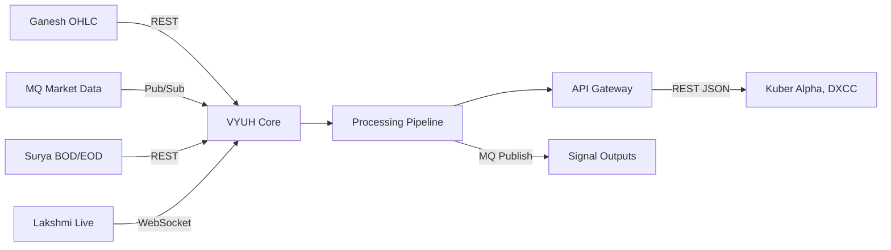

# VYUH — Data Flow

**Version:** 3.0.0 | **Owner:** Analytics | **Last Updated:** 2026-07-25

## Input → Process → Output Flow

## Data Ingestion Layer

- **Ganesh:** Historical OHLC data via REST API, polled every 5 seconds with bulk fetch support
- **MQ (RabbitMQ):** Real-time market data via pub/sub subscriptions on exchange `algo.market`
- **Surya:** BOD/EOD reference files via scheduled REST pull (daily at 09:15 IST)
- **Lakshmi:** Live price feed via WebSocket streaming with automatic reconnection

## Processing Pipeline

1. **Validation:** JSON Schema v7 validation against schema registry definitions
2. **Normalization:** Timestamp alignment to IST, symbol mapping via Surya master, data type coercion
3. **Computation:** Core analytics engine processes normalized data with sub-50ms latency
4. **Enrichment:** Cross-referencing with cached historical context from `TimescaleDB`
5. **Publication:** Results pushed to MQ topic `vyuh.output` and exposed via REST

## Output Distribution

- **REST APIs** on ports `3021` serve downstream consumers with pagination support
- **MQ broadcast** publishes computed analytics at configurable intervals
- **Webhook callbacks** for registered subscribers on data change events (configurable thresholds)

## Data Retention Policy

- **Hot data** (last 24 hours): In-memory cache + Redis (99.9% hit rate target)
- **Warm data** (24h - 7 days): Primary database with indexed query support
- **Cold data** (> 7 days): Compressed archive storage with lazy retrieval
